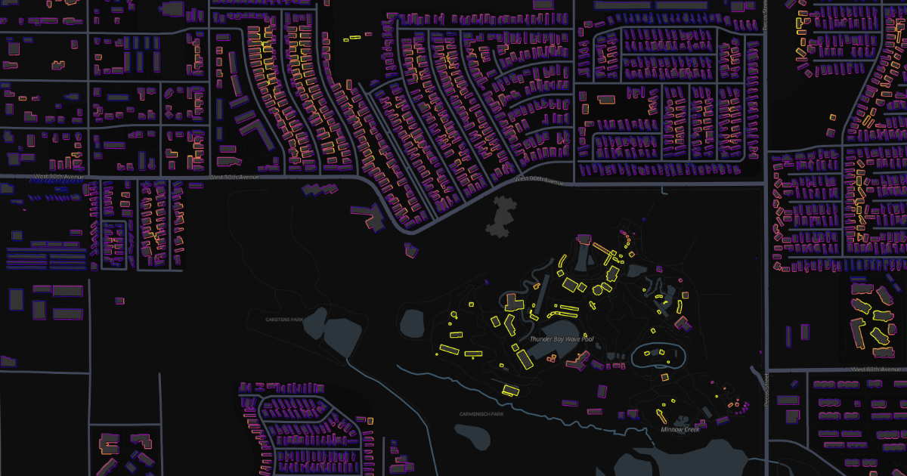

# OSM Wall-to-Street



[Interactive demo](https://byjtew.github.io/)

---

## Repository layout

- `rust/`: Rust extractor + Python tiling/build scripts
- `webapp/`: Vite frontend, static assets, and static server

Render your own:
1. Clone this repository
2. Download one or more `.osm.pbf` files from [Geofabrik](https://download.geofabrik.de/) into a directory (e.g. `pbf/`)
3. Run the build script:
   ```bash
   cd rust
   python3 build.py <input_dir> <output.pmtiles>
   ```
   For example:
   ```bash
   cd rust
   python3 build.py ./pbf/ colorado.pmtiles
   ```
4. Copy the resulting `.pmtiles` file to `webapp/dist/` (or where you serve the web app from), then serve the web app.

### Frontend (bundled static site)

This project now uses Vite to bundle JavaScript/CSS for a smaller delivered website:

```bash
cd webapp
npm install
npm run dev
```

Production build:

```bash
cd webapp
npm run build
```

The final static assets are emitted in `webapp/dist/`.

Serve `webapp/dist/` with your `.pmtiles` file.

### Build script options

| Option | Description |
|---|---|
| `--work-dir <dir>` | Directory for intermediate files (default: `<input_dir>/work`) |
| `--clean-geojson` | Delete per-region GeoJSON files after they have been converted to mbtiles |

The script is **restartable**: if both `<name>_dots.mbtiles` and `<name>_walls.mbtiles` already exist in the work directory for a given region, that region is skipped. Delete either mbtiles file to force reprocessing.

### Manual single-region workflow

If you prefer to run each step yourself:

```bash
cd rust
cargo run --release -- <path/to/file.osm.pbf> walls.geojson centroids.geojson
python3 tile.py centroids.geojson walls.geojson output.pmtiles
```
